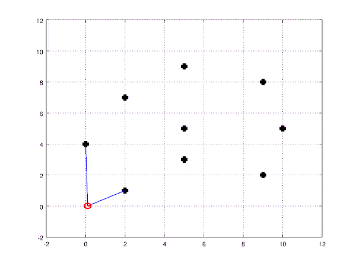
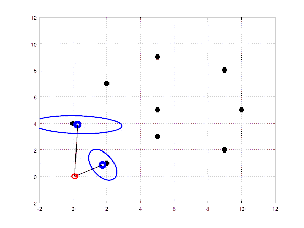
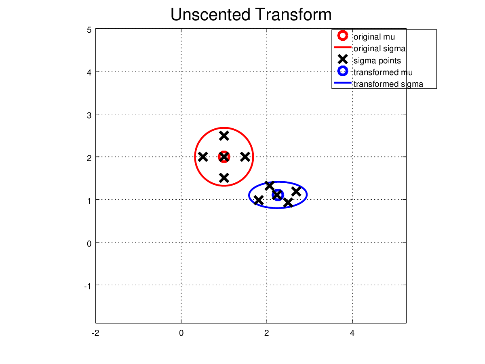
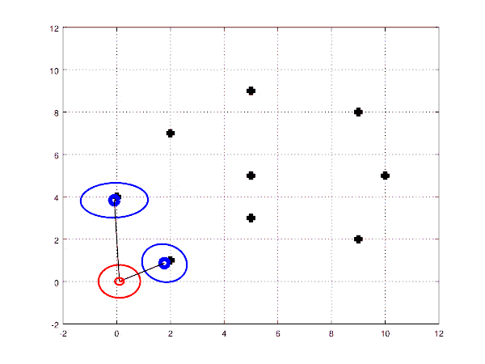
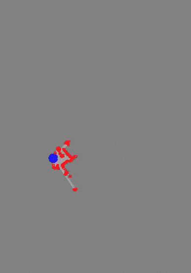
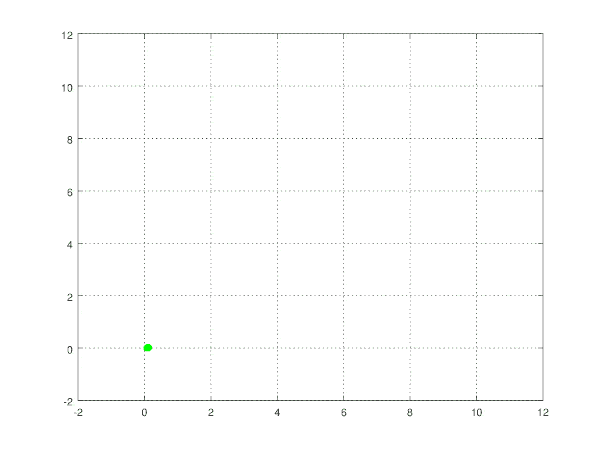
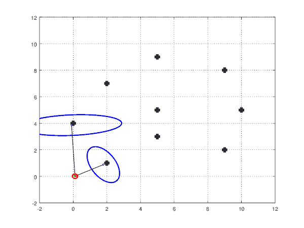
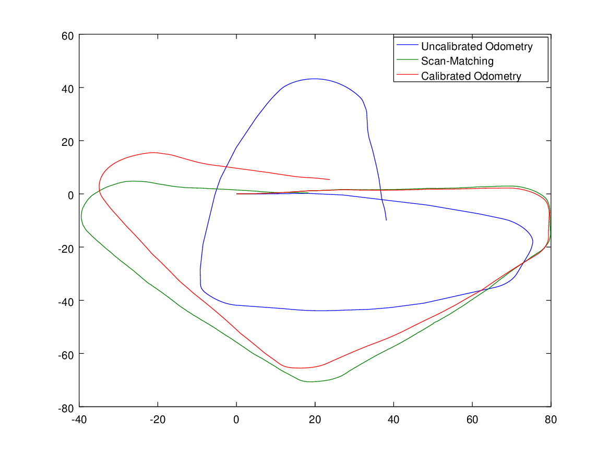

# Robot Mapping Course

This repository contains codes with solutions to the assignments of Robot Mapping course by [Cyrill Stachniss](http://www.informatik.uni-freiburg.de/~stachnis) 

**Course Page:** http://ais.informatik.uni-freiburg.de/teaching/ws13/mapping/

**Course Youtube Videos:** https://www.youtube.com/watch?v=U6vr3iNrwRA&list=PLgnQpQtFTOGQrZ4O5QzbIHgl3b1JHimN_

All codes tested on `Octave 4.0.0` on `Ubuntu 16.04.5`.

## Results

| Homework            | Animation/Image                                              |
| ------------------- | ------------------------------------------------------------ |
| Octave Tutorial     |  |
| EKF SLAM            |                    |
| Unscented Transform |       |
| UKF SLAM            |                    |
| Grid Mapping        |        |
| Particle Filter     |  |
| FAST SLAM           |                 |
| Odom Calibration    |  |
